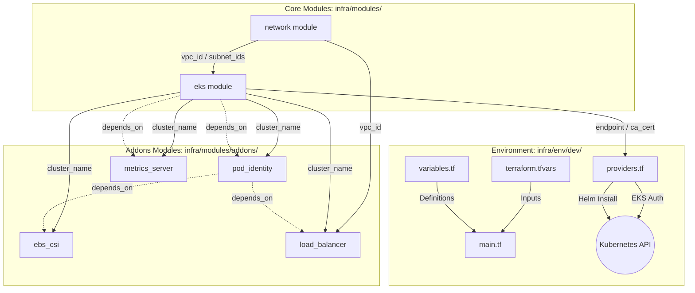
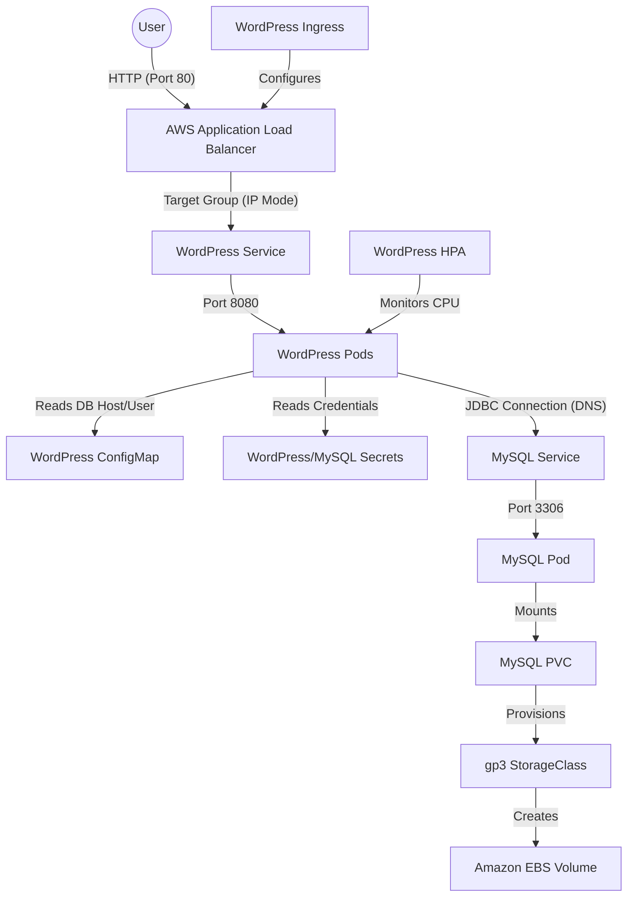

# DevOps Project: Scalable WordPress on AWS EKS

This project provides a demo presentation of Infrastructure-as-Code (IaC) and Kubernetes deployment for a WordPress application. It leverages AWS managed services, Terraform for infrastructure provisioning with a modular, environment-isolated architecture, and Kustomize for Kubernetes manifest management.

---

## Architecture Overview

### AWS Infrastructure (Terraform)
The infrastructure is designed for high availability, security, and cost-efficiency using a **Modular Design** and **Environment Isolation** pattern.

#### Terraform Component Schema
The following diagram illustrates how data flows from the environment configuration through the core modules to the Kubernetes API:



---

### Kubernetes Resources (Kustomize)
The application is deployed into the `devops-demo--wordpress` namespace using a modular Kustomize structure.

#### Kubernetes Resource Interconnection Schema
The following diagram illustrates the internal networking, discovery, and storage orchestration of the WordPress application:



#### 1. WordPress Application
- **Ingress to ALB**: The `wordpress-ingress` triggers the **AWS Load Balancer Controller** to provision an internet-facing ALB. Traffic is routed directly to Pod IPs for optimal performance.
- **Service Discovery**: WordPress connects to MySQL using the internal DNS name `mysql.devops-demo--wordpress.svc.cluster.local`, managed by CoreDNS.
- **Self-Healing**: Configured with `startup`, `liveness`, and `readiness` probes to ensure automated recovery and zero-downtime deployments.
- **HPA**: Automatically scales the frontend replicas based on CPU load.

#### 2. Database (MySQL)
- **StatefulSet**: Provides stable network identifiers and ordered deployment for the database layer.
- **Persistence**: Uses a `volumeClaimTemplate` to dynamically provision 20Gi `gp3` EBS volumes via the **AWS EBS CSI Driver**.
- **Headless Service**: Enables direct pod-to-pod communication if needed for future clustering.

---

## CI/CD Workflows (GitHub Actions)

1.  **Terraform Validation**: Checks formatting and configuration validity on every pull request.
2.  **Kustomize Validation**: Ensures Kubernetes manifests are correctly built and dependencies are resolved.
3.  **YAML Linting**: Enforces consistent formatting across all YAML configuration files.

---

## Performance Benchmarking

Resource utilization benchmarks under various load levels (using `hey`):

| Load Level | Requests/sec | Concurrency | WordPress CPU | MySQL CPU | Node CPU Avg |
| :--- | :--- | :--- | :--- | :--- | :--- |
| **Low** | 1 | 5 | ~160m | ~40m | ~7% |
| **Medium** | 5 | 5 | ~640m | ~130m | ~22% |
| **High** | 20 | 50 | ~1782m | ~297m | ~58% |

---

## How to Deploy

### Prerequisites
- **AWS CLI** (v2.x) configured with appropriate permissions.
- **Terraform** (>= 1.10).
- **kubectl** (v1.30+) and **kustomize** (v5.x+) installed.

### 1. Provision Infrastructure
```bash
cd infra/env/dev
terraform init
terraform plan
terraform apply -auto-approve
```

### 2. Configure Access
```bash
# Get the connection command from Terraform outputs
terraform output update_kubeconfig_command | xargs bash
```

### 3. Prepare Application Secrets
Before deploying, create the environment files required by Kustomize for sensitive data:
```bash
cd k8s/overlays/devops-demo-eks-aws-us-east-1/
```
Create `mysql-secrets.env`:
```text
MYSQL_ROOT_PASSWORD=your_root_password
MYSQL_USER_PASSWORD=your_db_user_password
```
Create `wordpress-secrets.env`:
```text
ADMIN_PASSWORD=your_wp_admin_password
```

### 4. Deploy Application
```bash
# Deploy using Kustomize
kubectl apply -k k8s/overlays/devops-demo-eks-aws-us-east-1/
```

### 5. Accessing WordPress
Once deployed, you can find the Application Load Balancer (ALB) URL by running:
```bash
kubectl get ingress -n devops-demo--wordpress
```
Access the **Admin Dashboard** at:
`http://<ALB_URL>/wp-admin`

**Login Credentials:**
*   **Username:** `admin` (as defined in `configmap.yaml`)
*   **Password:** The value provided in `wordpress-secrets.env`.

---

## Infrastructure Cleanup

To avoid ongoing AWS costs (NAT Gateways, EKS, EBS volumes) when the project is not in use:

```bash
# 1. Delete Kubernetes resources (cleanup Load Balancer and EBS volumes)
kubectl delete -k k8s/overlays/devops-demo-eks-aws-us-east-1/

# 2. Destroy AWS Infrastructure
cd infra/env/dev
terraform destroy -auto-approve
```
